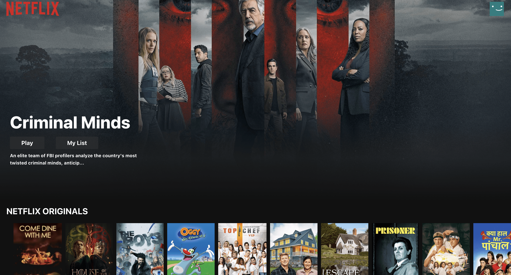
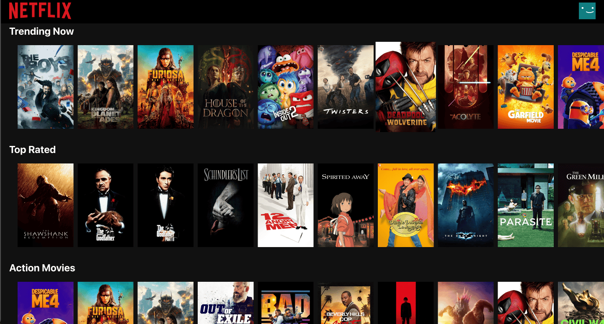
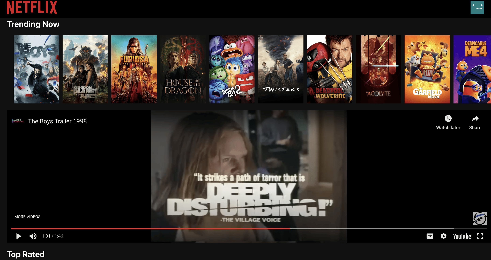
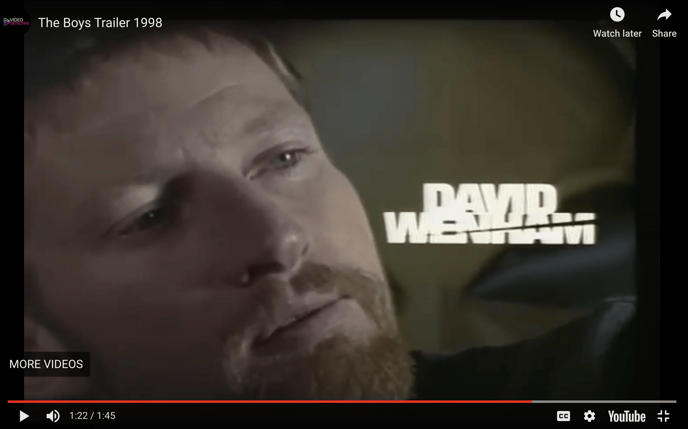

## **Netflix Clone: A React-based Streaming Platform**

**Overview:**

This project replicates the core functionalities of a streaming platform like Netflix. It leverages the power of React JS to deliver a seamless user experience across multiple web pages, including login, homepage, and movie details.

**Key Features:**

* **User Authentication:** Secure user authentication and authorization using Google Firebase.
* **Home Page:** A visually appealing homepage featuring a curated selection of movies and TV shows.
* **Movie Details:** Detailed information about each movie, including synopsis, cast, and trailers.
* **State Management:** Efficiently manages movie information and user state using Redux.

**Technical Implementation:**

* **Frontend:** React JS is employed to build the user interface, enabling dynamic and interactive components.
* **Backend:** Google Firebase provides authentication services and real-time database functionalities.
* **State Management:** Redux is used to manage the application's state, ensuring data consistency and efficient updates.

**Future Enhancements:**

* **Video Streaming:** Implement video streaming capabilities using a video player library like Video.js or React Player.
* **User Profiles:** Allow users to create personalized profiles and save their watch history.
* **Search Functionality:** Implement a robust search feature to help users find specific movies or TV shows.
* **Recommendations:** Utilize recommendation algorithms to suggest content based on user preferences.

This Netflix clone serves as a foundation for building more sophisticated streaming platforms, demonstrating the power of React and Firebase in creating engaging web applications.

